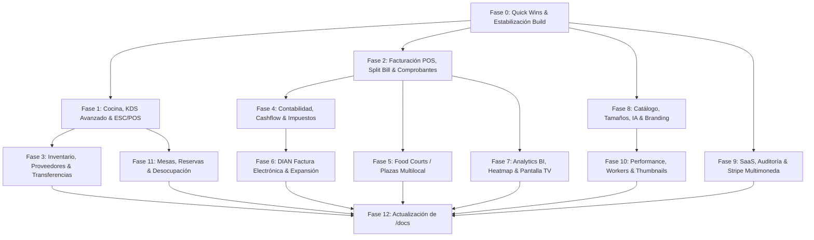

# Roadmap Integral de Implementación: Gaps, Mejoras y Hub Contable de iMenu

Este documento presenta el plan de arquitectura e implementación por fases para resolver todos los requerimientos mapeados de la ruta [/docs](file:///c:/Users/colla/Documents/git/projects/happyfox/iMenu/app/docs/page.tsx), incluyendo la ruta parcial del Hub de reportes contables, los 39 gaps funcionales y las 27 oportunidades de mejora técnica y de negocio.

El objetivo central del plan es **extender y reutilizar los componentes y librerías existentes** (NextAuth, Prisma ORM, Socket.IO, Vercel Blob, `lib/dian/`, `lib/accounting/`, `lib/inventory/`, `lib/analytics/` y los componentes visuales SVG), garantizando máxima mantenibilidad, escalabilidad y consistencia arquitectónica sin duplicar código.

---

## Estrategia de Reutilización de Código Existente

Para asegurar alta mantenibilidad y evitar duplicación, las implementaciones se apoyarán en las siguientes bases ya construidas:

| Área Funcional | Código Existente Reutilizable | Extensión / Nueva Capacidad |
| :--- | :--- | :--- |
| **Impresión de Tickets** | [ticket-print-button.tsx](file:///c:/Users/colla/Documents/git/projects/happyfox/iMenu/components/billing/ticket-print-button.tsx) (HTML/CSS para 80mm POS) | Extender a impresión ESC/POS directa vía red/Bluetooth y reutilizar el componente en la tabla del listado de facturas. |
| **Cierre de Mesa & Propina** | [table-checkout-form.tsx](file:///c:/Users/colla/Documents/git/projects/happyfox/iMenu/components/billing/table-checkout-form.tsx) & campo `serviceCharge` en [schema.prisma](file:///c:/Users/colla/Documents/git/projects/happyfox/iMenu/prisma/schema.prisma) | Integrar input de propina sugerida (10%, 15%, libre) en el wizard y reflejarlo en el ticket y la factura. |
| **Plano SVG de Salón** | [FloorPlanVisualizer.tsx](file:///c:/Users/colla/Documents/git/projects/happyfox/iMenu/components/tables/FloorPlanVisualizer.tsx) & [FloorPlanEditor.tsx](file:///c:/Users/colla/Documents/git/projects/happyfox/iMenu/components/tables/FloorPlanEditor.tsx) | Extender soporte para mesas de `foodCourtId` para visualizar el plano de Food Courts / Plazas. |
| **División de Cuenta (Split)** | [split/route.ts](file:///c:/Users/colla/Documents/git/projects/happyfox/iMenu/app/api/payments/split/route.ts) & [SplitBillPaymentModal.tsx](file:///c:/Users/colla/Documents/git/projects/happyfox/iMenu/components/menu/SplitBillPaymentModal.tsx) | Conectar los pagos divididos al modelo `Payment` de Prisma en el POS de caja para cierre consolidado. |
| **Notificaciones Push** | [sw.js](file:///c:/Users/colla/Documents/git/projects/happyfox/iMenu/public/sw.js) & `/api/push/subscribe` con VAPID | Extender eventos de comanda lista para notificar en pedidos multi-restaurante de Food Courts. |
| **Motor Contable** | [calculator.ts](file:///c:/Users/colla/Documents/git/projects/happyfox/iMenu/lib/accounting/calculator.ts) & [types.ts](file:///c:/Users/colla/Documents/git/projects/happyfox/iMenu/lib/accounting/types.ts) | Añadir función `calculateCashflow`, depreciación de activos fijos y retención en la fuente. |
| **Motor de Analítica** | [engine.ts](file:///c:/Users/colla/Documents/git/projects/happyfox/iMenu/lib/analytics/engine.ts) | Agregar comparativas MoM/YoY, ticket promedio por mesero/mesa, heatmap y regresión de demanda. |
| **Módulo DIAN SOAP** | [soap-client.ts](file:///c:/Users/colla/Documents/git/projects/happyfox/iMenu/lib/dian/soap-client.ts) & [ubl-builder.ts](file:///c:/Users/colla/Documents/git/projects/happyfox/iMenu/lib/dian/ubl-builder.ts) | Incorporar `SendTestSetAsync`, `GetStatusZip`, `SendEventUpdateStatus` y Notas Crédito/Débito. |
| **Servicio de Almacenamiento** | [storage.ts](file:///c:/Users/colla/Documents/git/projects/happyfox/iMenu/lib/storage.ts) | Añadir generación de thumbnails multipantalla (150px, 300px, 600px) con `sharp` y purga de caché. |
| **Emails Transaccionales** | [email.ts](file:///c:/Users/colla/Documents/git/projects/happyfox/iMenu/lib/email.ts) | Reutilizar `baseTemplate` y `sendMail` para onboarding, aviso de trial por expirar y resumen de KPIs. |

---

## User Review Required

> [!IMPORTANT]
> **Estrategia de Ejecución Modular**:
> Debido al alcance extenso (67 requerimientos en total), el trabajo se estructura en 13 fases ordenadas por dependencias lógicas y valor inmediato de negocio.
> - **Fase 0 (Quick Wins & Estabilización)** se enfoca en resolver los bloqueantes inmediatos de compilación y habilitar funcionalidades casi terminadas en UI.
> - Las **Fases 1 a 11** desarrollan los módulos operativos, financieros, fiscales, analíticos y de experiencia de usuario.
> - La **Fase 12** actualiza la ruta `/docs` marcando como `done` lo implementado y refinando el inventario de gaps futuros.

> [!NOTE]
> Para la facturación electrónica DIAN en ambientes de prueba, se mantendrá el fallback simulado transparente cuando no se disponga de certificado `.p12` real del cliente, permitiendo probar flujos sin bloquear la compilación ni los tests.

---

## Roadmap de Implementación en 13 Fases

---

### Fase 0: Quick Wins Inmediatos & Estabilización de Build (Prerrequisito)
**Objetivo**: Eliminar el error de build de TypeScript actual y habilitar 4 mejoras directas que aportan valor instantáneo con mínimo esfuerzo.

1. **Corrección de tipado en subida de PDF**:
   - Archivo: [route.ts](file:///c:/Users/colla/Documents/git/projects/happyfox/iMenu/app/api/pdf/upload/route.ts#L109)
   - Corregir `pdfPageImages: null` por `pdfPageImages: Prisma.JsonNull` para satisfacer el tipo `NullableJsonNullValueInput` de Prisma v5.
2. **Reimpresión rápida de tickets desde el listado de facturas**:
   - Archivo: [invoices/page.tsx](file:///c:/Users/colla/Documents/git/projects/happyfox/iMenu/app/%28dashboard%29/dashboard/billing/invoices/page.tsx)
   - Incrustar [TicketPrintButton](file:///c:/Users/colla/Documents/git/projects/happyfox/iMenu/components/billing/ticket-print-button.tsx) como acción directa en cada fila de la tabla de facturas cerradas (PAID/ISSUED), permitiendo reimpresión con 1 clic sin entrar al detalle.
3. **Propina editable en el wizard de cierre de mesa**:
   - Archivo: [table-checkout-form.tsx](file:///c:/Users/colla/Documents/git/projects/happyfox/iMenu/components/billing/table-checkout-form.tsx)
   - Añadir selector rápido de propina (0%, 10%, 15% o monto personalizado) mapeado al campo `serviceCharge` de la factura y reflejado en el total general.
4. **Hub de Reportes Contables**:
   - Archivo: `app/(dashboard)/dashboard/accounting/reports/page.tsx` [NUEVO]
   - Crear la vista principal del Hub de Reportes con tarjetas interactivas de acceso a:
     - Estado de Resultados (P&L)
     - Reporte de IVA (Formulario 300)
     - Flujo de Caja (Cashflow)
     - Resumen Ejecutivo Fiscal

---

### Fase 1: Cocina & KDS Avanzado, Ruteo e Impresión Hardware
**Objetivo**: Control físico y digital del despacho en cocina, separando estaciones y conectando impresoras térmicas.

1. **Integración con impresoras térmicas de cocina (ESC/POS)**:
   - Crear helper `lib/hardware/escpos-printer.ts` para enviar comandos ESC/POS vía WebUSB, Web Bluetooth o socket TCP de red local (`9100`).
   - Crear componente `KitchenPrinterSettings` en configuración para registrar impresoras de cocina con IP/puerto o emparejamiento Bluetooth.
2. **Ruteo multi-estación de cocina**:
   - Modificar modelo `Product` o `Category` agregando campo opcional `kitchenStation` (`PARRILLA`, `FREIDORA`, `BARRA_FRIA`, `BEBIDAS`, `GENERAL`).
   - En el KDS ([dashboard/kds/page.tsx](file:///c:/Users/colla/Documents/git/projects/happyfox/iMenu/app/%28dashboard%29/dashboard/kds/page.tsx) y [/kds/page.tsx](file:///c:/Users/colla/Documents/git/projects/happyfox/iMenu/app/kds/page.tsx)), añadir filtro selector de estación para que la tablet de la parrilla solo muestre los ítems de parrilla.
3. **Filtro dinámico de comandas por zona de mesas**:
   - En KDS, añadir selector de zona (`Terraza`, `Salón Principal`, `Barra`, `VIP`, `Todas`) aprovechando el campo `Table.zone`.
4. **Predicción de tiempo de despacho en cocina**:
   - Extender `/api/kitchen/load` para calcular tiempo estimado de preparación dinámico combinando platos activos y ritmo histórico de entrega.

---

### Fase 2: Facturación POS, Split Bill, Pagos Digitales & Comprobantes
**Objetivo**: Flexibilizar el pago y la entrega de comprobantes en caja y mesa.

1. **División de cuenta (Split Bill) — 3 Modalidades Específicas**:

   El [SplitBillPaymentModal.tsx](file:///c:/Users/colla/Documents/git/projects/happyfox/iMenu/components/menu/SplitBillPaymentModal.tsx) ya implementa el tipo `SplitMode = 'INDIVIDUAL' | 'EQUAL' | 'CUSTOM' | 'FULL'` con 4 opciones. El trabajo consiste en **refinar y separar** el modo `CUSTOM` en dos conceptos distintos y ajustar las etiquetas de los existentes para que correspondan exactamente a las 3 modalidades de negocio requeridas:

   | Modalidad | `splitType` actual / nuevo | Descripción de negocio | Cambio requerido |
   |:---|:---|:---|:---|
   | **⚖️ Partes Iguales** | `EQUAL` (ya existe) | Si van 6 comensales, cada quien paga exactamente 1/6 del total. El pagador selecciona cuántas personas hay en la mesa (stepper ±). | El stepper ya existe. Solo afinar etiqueta e incluir el divisor en el comprobante. |
   | **👥 Pagar por personas seleccionadas** | `BY_PERSON` (nuevo splitType) | El pagador elige explícitamente por cuáles comensales paga (ej: "Yo pago por mí + mi novia + mi hermana, pero no por los demás"). Requiere que los comensales tengan un `userAlias` registrado en la sesión. | Añadir nueva modalidad al enum `SplitMode`. UI: checklist de aliases/comensales activos en la sesión, sumando el subtotal de los ítems atribuidos a cada alias seleccionado. Backend: persistir `coveredAliases[]` en `itemsPaid`. |
   | **🧾 Lo que cada quien ordenó** | `INDIVIDUAL` (ya existe) | Cada comensal paga exactamente los platos que él ordenó, sin contribuir a lo de los demás. | Ya implementado via `orderedByNames`. Mejorar la UI para mostrar el desglose ítem por ítem con los nombres de quién lo pidió, y resaltar claramente si hay platos sin dueño asignado (platos de mesa compartida). |

   **Archivos a modificar:**
   - [SplitBillPaymentModal.tsx](file:///c:/Users/colla/Documents/git/projects/happyfox/iMenu/components/menu/SplitBillPaymentModal.tsx): añadir `'BY_PERSON'` al tipo `SplitMode`, nueva sección de UI con checklist de aliases, cálculo de `baseAmount` para la nueva modalidad sumando ítems de los aliases seleccionados.
   - [split/route.ts](file:///c:/Users/colla/Documents/git/projects/happyfox/iMenu/app/api/payments/split/route.ts): actualizar el schema Zod de `splitType` para incluir `'BY_PERSON'`, y persistir `coveredAliases` junto a `itemsPaidJson`.

   > [!NOTE]
   > El modo `CUSTOM` actual (elegir platos individuales del checklist general) se mantiene pero se renombra a **"Elegir platos"** para diferenciarlo claramente del nuevo **"Pagar por personas"**. El modal pasa de 4 a 5 opciones en la grilla de selección.

   **En el POS de caja** ([close-table/[tableId]/page.tsx](file:///c:/Users/colla/Documents/git/projects/happyfox/iMenu/app/%28dashboard%29/dashboard/billing/close-table/%5BtableId%5D/page.tsx) y [table-checkout-form.tsx](file:///c:/Users/colla/Documents/git/projects/happyfox/iMenu/components/billing/table-checkout-form.tsx)), incorporar pestaña "Dividir Cuenta" que permita registrar múltiples pagos (`Payment[]`) con distintos métodos (ej. $50k efectivo + $30k tarjeta) hasta saldar el balance de la factura.

2. **Cobro con QR directo en mesa (Pasarelas Digitales)**:
   - Extender [app/api/payments/split/route.ts](file:///c:/Users/colla/Documents/git/projects/happyfox/iMenu/app/api/payments/split/route.ts) y [SplitBillPaymentModal.tsx](file:///c:/Users/colla/Documents/git/projects/happyfox/iMenu/components/menu/SplitBillPaymentModal.tsx) para generar intents/links de pago en vivo para Wompi, MercadoPago, Bold o Stripe.
3. **Integración con POS Físico (Datafonos Ingenico/Verifone)**:
   - Crear adaptador `lib/hardware/pos-terminal.ts` que soporte comunicación vía WebSerial o API local para enviar el monto a cobrar a la terminal y esperar confirmación.
4. **Generación masiva de comprobantes comprimidos en ZIP**:
   - Crear endpoint `/api/export/invoices/zip` que reciba rango de fechas y filtros, recolecte los comprobantes y genere un archivo ZIP usando `jszip`.
5. **Factura proforma o presupuesto**:
   - Permitir emitir desde el listado de facturas o cotizaciones una factura proforma en PDF para eventos/grupos sin afectar la numeración fiscal consecutiva.

---

### Fase 3: Inventario Integral, Proveedores, Conteo Físico & Transferencias
**Objetivo**: Control formal de la cadena de suministro, arqueo de existencias y traslados entre sedes.

1. **Módulo de Compras y Proveedores**:
   - Modelos Prisma: `Supplier` (nombre, NIT, teléfono, email, dirección) y `PurchaseOrder` (estado, proveedor, ítems, total).
   - Crear vistas `/dashboard/inventory/suppliers` y `/dashboard/inventory/purchases` para registrar órdenes de compra que actualicen stock automáticamente al recibirlas (`PURCHASE`).
2. **Inventario físico periódico & conciliación de diferencias**:
   - Crear ruta `/dashboard/inventory/physical-count`: tabla interactiva donde el personal ingresa el stock contado manualmente; el sistema calcula discrepancias (faltante/sobrante) y genera movimientos `ADJUSTMENT` con notas de auditoría.
3. **Predicción de reposición de insumos**:
   - En [dashboard/inventory/page.tsx](file:///c:/Users/colla/Documents/git/projects/happyfox/iMenu/app/%28dashboard%29/dashboard/inventory/page.tsx), añadir columna predictiva: "En X días te quedarás sin insumo", basada en el promedio de consumo de los últimos 14 días (`stockActual / consumoDiario`).
4. **Transferencias entre sucursales**:
   - Crear endpoint `/api/inventory/transfers` y vista `/dashboard/inventory/transfers`: permite a franquicias con múltiples sedes transferir insumos atómicamente (`TRANSFER` resta en sede origen y suma en sede destino).
5. **Alertas automáticas por WhatsApp al proveedor**:
   - Botón directo y webhook para enviar pedido estándar por WhatsApp (`wa.me`) al proveedor cuando un insumo caiga por debajo de su `minStock`.
6. **Escaneo de códigos de barra / QR en insumos**:
   - Integrar lector de códigos de barra (HTML5 Camera Barcode Scanner / Web Barcode API) en el formulario de conteo físico para agilizar inventario.

---

### Fase 4: Contabilidad Financiera, Cashflow, Activos & Fiscalidad Avanzada
**Objetivo**: Completar la suite contable para gerentes y contadores.

1. **Reporte de Flujo de Caja (Cashflow)**:
   - Crear ruta `/dashboard/accounting/reports/cashflow` y extender `calculateCashflow` en [calculator.ts](file:///c:/Users/colla/Documents/git/projects/happyfox/iMenu/lib/accounting/calculator.ts): entradas de efectivo (ventas al contado, cobros electrónicos), salidas operativas (pagos a proveedores, nómina, arriendo) y saldo neto de caja.
2. **Exportación de P&L, IVA y Cashflow a Excel y PDF**:
   - Crear endpoints `/api/export/accounting/pl` y `/api/export/accounting/vat` que generen reportes listos para imprimir en PDF estilizado o descargar en Excel con fórmulas.
3. **Contabilidad de depreciación de activos fijos**:
   - Crear modelo `FixedAsset` (nombre, costo de adquisición, vida útil en meses, valor residual, fecha) y cálculo mensual de depreciación como gasto contable de equipo.
4. **Manejo de Retención en la Fuente**:
   - En [tax-config-form.tsx](file:///c:/Users/colla/Documents/git/projects/happyfox/iMenu/components/billing/tax-config-form.tsx) y en la creación de facturas a empresas (con NIT), permitir aplicar ReteFuente (ej. 2.5% o 3.5%), ReteIVA y ReteICA.
5. **Módulo de Nómina Simplificado**:
   - Crear vista `/dashboard/accounting/payroll` para registrar pagos de salarios, horas extras y seguridad social, categorizados automáticamente como gasto `LABOR`.
6. **Conciliación Bancaria**:
   - Vista `/dashboard/accounting/bank-reconciliation`: subir extracto bancario en CSV y cruzar automáticamente por fecha y monto con las ventas y gastos registrados.
7. **Generación de archivo plano XML para Formulario 300 DIAN**:
   - Generar el archivo compatible para importar directamente en el portal MUISCA de la DIAN.

---

### Fase 5: Food Courts / Plazas Gastronómicas Multilocal
**Objetivo**: Potenciar la experiencia de plazas donde múltiples restaurantes comparten el salón.

1. **Mapa visual SVG del salón de la plaza**:
   - Adaptar [FloorPlanVisualizer.tsx](file:///c:/Users/colla/Documents/git/projects/happyfox/iMenu/components/tables/FloorPlanVisualizer.tsx) en [dashboard/food-courts/[id]/page.tsx](file:///c:/Users/colla/Documents/git/projects/happyfox/iMenu/app/%28dashboard%29/dashboard/food-courts/%5Bid%5D/page.tsx) para renderizar las mesas asignadas al `foodCourtId` con coordenadas reales y capacidad.
2. **Notificaciones Push al comensal en pedidos multi-restaurante**:
   - Extender el servicio de Web Push ([sw.js](file:///c:/Users/colla/Documents/git/projects/happyfox/iMenu/public/sw.js) y `/api/push/send`): cuando cualquiera de los restaurantes de la plaza marque su comanda como `READY`, se dispara una notificación push al celular del cliente indicando qué restaurante tiene el pedido listo.
3. **Exportación de liquidaciones y comisiones en CSV/PDF**:
   - En la pestaña de Comisiones de la plaza, añadir botones de exportación a CSV (BOM UTF-8) y PDF oficial de liquidación por restaurante.
4. **Pago unificado al final de la sesión**:
   - Implementar unificación de cobranza en [FoodCourtBillSheet.tsx](file:///c:/Users/colla/Documents/git/projects/happyfox/iMenu/components/food-court/FoodCourtBillSheet.tsx): el cliente abona el total general en una única transacción y el backend liquida internamente las cuentas de cada local.
5. **Benchmarking y analytics comparativos entre plazas**:
   - Crear pestaña de Analytics en el panel de Food Courts comparando ticket promedio, rotación de mesas y ventas entre restaurantes miembros y sedes.

---

### Fase 6: Facturación Electrónica DIAN Directa & Expansión Regional
**Objetivo**: Completar el ciclo de emisión electrónica oficial en Colombia y preparar adaptadores internacionales.

1. **Set de Pruebas Automatizado (SendTestSetAsync)**:
   - Crear endpoint `/api/billing/electronic-invoicing/test-set` que ejecute automáticamente el lote de pruebas requerido por la DIAN contra el ambiente de habilitación.
2. **Polling automático de estado de facturas (GetStatusZip)**:
   - Implementar cron / worker de verificación para facturas con estado `pending` en `ElectronicInvoiceLog`, consultando el servicio SOAP de la DIAN y actualizando a `accepted` o `rejected`.
3. **Cancelación electrónica ante la DIAN (SendEventUpdateStatus)**:
   - En [soap-client.ts](file:///c:/Users/colla/Documents/git/projects/happyfox/iMenu/lib/dian/soap-client.ts), implementar la emisión del evento de anulación con código oficial DIAN.
4. **Notas Crédito y Notas Débito electrónicas UBL 2.1**:
   - Extender [ubl-builder.ts](file:///c:/Users/colla/Documents/git/projects/happyfox/iMenu/lib/dian/ubl-builder.ts) para generar XML UBL 2.1 de `CreditNote` y `DebitNote` con referencia al CUFE de la factura original.
5. **Acuse de recibo del comprador (B2B)**:
   - Soporte para eventos de ApplicationResponse: recibo de factura, recibo de bienes/servicios y aceptación expresa.
6. **Verificación pública de CUFE en la DIAN**:
   - Añadir en el detalle de la factura y en el ticket PDF un botón que abra directamente: `https://catalogo-vpfe.dian.gov.co/document/searchqr?documentkey=${cufe}`.
7. **Modo de contingencia DIAN**:
   - Soporte para factura de talonario / contingencia (Tipo 03 / Tipo 04) cuando los servidores de la DIAN no responden.
8. **Adaptadores fiscales para México (SAT/CFDI 4.0) y Chile (SII/DTE)**:
   - Crear `lib/fiscal/sat-mexico.ts` y `lib/fiscal/sii-chile.ts` siguiendo el patrón de interfaz modular de [types.ts](file:///c:/Users/colla/Documents/git/projects/happyfox/iMenu/lib/dian/types.ts).

---

### Fase 7: Analytics BI, Heatmaps, Predicción & TV Executive Mode (✅ Completada)
**Objetivo**: Visualización gráfica de alta gama y herramientas predictivas de gestión.

1. **Comparativa temporal (MoM y YoY)**:
   - En [engine.ts](file:///c:/Users/colla/Documents/git/projects/happyfox/iMenu/lib/analytics/engine.ts), calcular métricas comparativas: mes vs. mes anterior y año vs. año anterior (% crecimiento ventas, ticket promedio, transacciones).
2. **Gráficas visuales interactivas**:
   - Sustituir tablas y barras CSS simples en [dashboard/analytics/page.tsx](file:///c:/Users/colla/Documents/git/projects/happyfox/iMenu/app/%28dashboard%29/dashboard/analytics/page.tsx) por gráficos vectoriales SVG limpios (curvas de tendencia, gráficos de dona para categorías, barras agrupadas).
3. **Análisis de ticket promedio por mesero, mesa y día**:
   - Desglosar en la UI el rendimiento por mesero (ventas totales, ticket promedio, propinas generadas) y por mesa.
4. **Heatmap visual de mesas por ocupación y rotación**:
   - Integrar un mapa térmico sobre el plano del salón donde los colores (verde, amarillo, naranja, rojo) reflejen qué mesas generan más facturación y rotación.
5. **Predicción de demanda (Regresión)**:
   - Algoritmo en `engine.ts` que estime comensales e ingresos proyectados para los próximos 7 días según histórico acumulado.
6. **Dashboard Ejecutivo en tiempo real para Pantalla de TV**:
   - Crear ruta `/dashboard/analytics/live-tv`: vista a pantalla completa con tema oscuro de alto contraste, KPIs del día actualizables en vivo por WebSocket y sin menús laterales.
7. **Reporte automático periódico por email**:
   - Tarea programada que compile el resumen semanal de ventas y lo envíe por email al `ADMIN`.
8. **Segmentación de ventas por tipo de servicio**:
   - Segmentar métricas entre: Mesa (QR/Presencial), Barra y Delivery.

---

### Fase 8: Catálogo, Variantes de Tamaño, IA Gastronómica & Branding ✅ (Completada)
**Objetivo**: Flexibilidad en la configuración de la carta y herramientas visuales para el restaurante.

1. **Variantes de tamaño con precios escalonados directos** ✅:
   - Soporte en modelo `Product.sizes` y utilidades en `lib/menu/sizes.ts`. Editor dinámico en `ProductForm.tsx`, selección interactiva en `ProductModal.tsx` con badges "Desde $X" en `MenuManager.tsx` y `MenuPage.tsx`.
2. **Traducción automática multilingüe del menú con IA** ✅:
   - Endpoint `/api/menu/translate` con motor OpenAI + diccionario culinario lingüístico de alta fidelidad en `lib/menu/translator.ts` (español a inglés `en` y portugués `pt`). Botón de acción con 1 clic en `MenuManager.tsx` y visualización multilingüe en `MenuPage.tsx`.
3. **Generador de temas y paletas a partir de foto del local** ✅:
   - Módulo de cuantización cromática, median-cut sampling y armonías HSL en `lib/branding/palette-extractor.ts`. Zona de subida fotográfica con detección de colores dominantes y aplicación de tema en `BrandStudioClient.tsx`.
4. **Modo de previsualización con código QR en vivo** ✅:
   - Ruta `/preview/brand` con renderizado reactivo según query params del draft theme. Modal en `BrandStudioClient.tsx` con código QR generado en vivo para escaneo y navegación en smartphones.
5. **Exportación del Brand Kit en PDF** ✅:
   - Endpoint `/api/brand/brand-kit` que compila especificaciones tipográficas, paleta cromática con contraste WCAG y morfología de botones con soporte de impresión y exportación a PDF.
6. **Editor visual de favicons y generación de iconos PWA** ✅:
   - Generación de iconos PWA (32x32, 180x180, 192x192, 512x512 y `manifest.json`), descarga en paquete `.zip` vía JSZip y sincronización en servidor vía `/api/brand/icons`.
7. **Gestión de certificados SSL delegados (Caddy / Let's Encrypt)** ✅:
   - Endpoint `/api/brand/domain/check-tls` que valida dominios autorizados para proxies Caddy On-Demand TLS y Cloudflare for SaaS, con panel explicativo en `BrandStudioClient.tsx`.

---

### Fase 9: SaaS Multitenant, Onboarding & Facturación Stripe ✅ (Completada)
**Objetivo**: Robustecer la plataforma SaaS para la adquisición, retención y administración de clientes.

1. **Registro de auditoría de accesos (Audit Log)** ✅:
   - Modelo `AuditLog` en Prisma y base de datos con índices de consulta por usuario, organización, restaurante y evento.
   - Módulo `lib/audit.ts` con helpers `recordAuditLog` y `getRecentAuditLogs` extrayendo automáticamente IP (`x-forwarded-for`, `x-real-ip`, Cloudflare) y User-Agent vía headers de Next.js.
   - Integrado en `lib/auth.ts` para registrar `LOGIN_SUCCESS`, `LOGIN_FAILED` y `2FA_FAILED`.
   - Endpoint `/api/security/audit-logs` y tabla visual en `/dashboard/settings/security` con badges de eventos, badges de dispositivos (Chrome/Safari/Firefox/Móvil), IP y refresco en tiempo real.
2. **Emails de onboarding y alertas de trial** ✅:
   - Plantillas visuales en `lib/email.ts`: `sendOnboardingWelcomeEmail` (guía de 3 pasos: 1: Menú Digital, 2: Mesas, 3: QR) y `sendTrialExpiringEmail` (alertas de urgencia 3 días y 1 día antes con botón directo a facturación).
   - `app/register/actions.ts` envía automáticamente la bienvenida al registrarse.
   - Endpoint `/api/cron/trial-alerts` para ejecución programada con inspección de fechas de corte y registro en `AuditLog`.
3. **Facturación en moneda local (COP, MXN, USD) en Stripe** ✅:
   - Matriz multidivisa en `lib/subscription.ts` con función `getPlanPrice(tier, interval, currency)`.
   - Configuración en `lib/stripe.ts` para inferir o recibir la moneda local del restaurante/organización y pasarla a Stripe Checkout (`currency: 'cop' | 'mxn' | 'usd'`).
   - Selector visual de divisa en `/dashboard/settings/billing` con cálculo reactivo de tarifas.
4. **Páginas de éxito y cancelación de checkout Stripe** ✅:
   - Pantalla de éxito en `/dashboard/settings/billing/success` con confirmación, badges de beneficios desbloqueados y accesos directos al panel.
   - Pantalla de cancelación en `/dashboard/settings/billing/cancel` con explicación de no cargo, preservación de datos y botones de reintento y soporte WhatsApp.
   - Endpoint `/api/billing/subscription` conectado con ambos destinos.
5. **Revocación automática de sedes excedentes al degradar plan** ✅:
   - Función `enforceBranchLimitOnDowngrade` en `lib/subscription.ts` que conserva activas las sucursales más antiguas según el cupo del nuevo plan y desactiva las excedentes (`isActive: false`), registrando auditoría `BRANCHES_DEACTIVATED`.
   - Integrado en `lib/stripe.ts` (`handleSubscriptionUpgrade`) y en los webhooks de Stripe `app/api/webhooks/stripe/route.ts` ante `customer.subscription.updated` y `customer.subscription.deleted`.
6. **Programa de referidos** ✅:
   - Modelo `ReferralCode` en Prisma con unicidad de códigos, conteo de usos y porcentajes de descuento.
   - Biblioteca `lib/referrals.ts` (`getOrCreateReferralCode`, `validateReferralCode`, `applyReferralCodeToRegistration`, `getReferralStats`).
   - Endpoint `/api/referrals` para estadísticas de referidos y validación pública de códigos.
   - Campo de código de referido en `/register` (con detección automática vía URL `?ref=XYZ` y badge de 20% OFF) procesado en `registerRestaurant`.
   - Dashboard de referidos en `/dashboard/settings/billing` con código de invitación, botón de copiado al portapapeles, botón de compartir en WhatsApp y métricas en vivo.

---

### Fase 10: Performance, Almacenamiento & Background Workers
**Objetivo**: Escalar el procesamiento de cartas y medios pesados en la nube.

1. **Background Workers para PDFs extensos (>50 páginas)**:
   - Arquitectura de cola de tareas en segundo plano (vía Redis / BullMQ o Serverless Queue) para convertir PDFs pesados a WebP sin bloquear la petición HTTP del usuario ni provocar timeout en Vercel.
2. **Generación automática de variantes de miniaturas (Thumbnails)**:
   - Al subir fotos de platos en `/api/menu/upload`, generar con `sharp` versiones optimizadas en 150px, 300px y 600px para carga ultrarrápida en listas móviles.
3. **Purga instantánea de caché CDN**:
   - En [storage.ts](file:///c:/Users/colla/Documents/git/projects/happyfox/iMenu/lib/storage.ts), añadir función para invalidar la caché de páginas del menú en la CDN cuando el administrador actualiza precios o platillos.

---

### Fase 11: Mesas, Reservas & Experiencia del Comensal
**Objetivo**: Optimizar la rotación física del salón y la experiencia de reserva.

1. **Notificaciones SMS / WhatsApp para reservas**:
   - Enviar confirmación y recordatorio automático (2 horas antes) al teléfono del comensal (`customerPhone`) vía WhatsApp / SMS al registrar una reserva.
2. **Predicción de desocupación de mesas**:
   - Calcular en el tablero de mesas el tiempo estimado para que una mesa quede libre, evaluando el tiempo transcurrido desde la última orden servida y la duración promedio de sobremesa.
3. **Pre-orden y pre-pago en reservas**:
   - Permitir al cliente seleccionar platos y anticipar el pago al confirmar su reserva para tener la comida lista al llegar.

---

### Fase 12: Actualización de la Documentación en `/docs` (Paso Final Solicitado)
**Objetivo**: Reflejar el estado real y sincronizado de la plataforma en la documentación oficial accesible en [/docs](file:///c:/Users/colla/Documents/git/projects/happyfox/iMenu/app/docs/page.tsx).

1. **Actualizar estado de rutas**:
   - Cambiar de `partial` o `missing` a `done` todas las rutas creadas o completadas:
     - `/dashboard/accounting/reports` (de `partial` a `done`)
     - `/dashboard/accounting/reports/cashflow` (`done`)
     - `/dashboard/inventory/suppliers` (`done`)
     - `/dashboard/inventory/physical-count` (`done`)
     - `/dashboard/inventory/transfers` (`done`)
     - `/dashboard/analytics/live-tv` (`done`)
     - `/dashboard/settings/billing/success` (`done`)
     - `/dashboard/settings/billing/cancel` (`done`)
2. **Actualizar métricas globales**:
   - Actualizar contadores de `totalRoutes`, `doneRoutes` y módulos.
3. **Sincronizar listas de Gaps y Oportunidades**:
   - Retirar los ítems resueltos de las listas `missing` y `opportunities` de cada módulo en `app/docs/page.tsx`.
   - Incorporar nuevas observaciones técnicas derivadas de las implementaciones.
   - Mantener claramente documentados los gaps futuros de largo plazo para la siguiente iteración.

---

## Plan de Verificación y Pruebas

### Pruebas Automatizadas
- Verificación estática de tipos: `npx tsc --noEmit`
- Validación de compilación Next.js: `npm run build`
- Pruebas de integración para endpoints clave:
  - Cálculo de P&L / Cashflow: `/api/accounting/reports/pl` y `/api/accounting/reports/cashflow`
  - Auditoría de login con captura de headers IP/UA: `/api/auth/[...nextauth]`
  - Emisión y validación CUFE: `lib/dian/cufe.ts`
  - Conciliación de inventario físico: `lib/inventory/stock-manager.ts`

### Verificación Manual & Funcional
- **Flujo POS & Facturación**: Simular cierre de mesa con propina editable y división de pago (efectivo + tarjeta).
- **Split Bill — 3 modalidades**: Verificar en el menú QR (comensal) que las 3 modalidades calculan correctamente:
  - **Partes iguales**: Mesa de 6 → cada comensal ve exactamente `total / 6`.
  - **Pagar por personas**: Seleccionar 2 aliases de 6 → monto = suma de los ítems de esos 2 comensales.
  - **Lo que cada quien ordenó**: El comensal ve solo sus ítems confirmados con `orderedByNames`.
- **Impresión Térmica**: Probar botón de reimpresión rápida en listado de facturas sin entrar al detalle.
- **KDS Cocina**: Probar filtro por estación y por zona de mesas en tablet/pantalla KDS.
- **Hub de Reportes**: Navegar por `/dashboard/accounting/reports` y verificar apertura fluida de sub-reportes (P&L, IVA, Cashflow).
- **Ruta /docs**: Acceder a `http://localhost:3000/docs` y verificar que la documentación refleje el 100% de los estados actualizados sin errores de renderizado.
